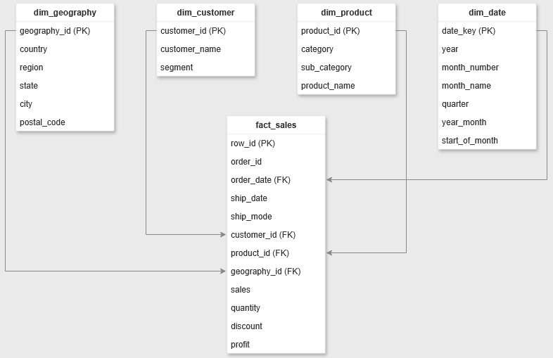
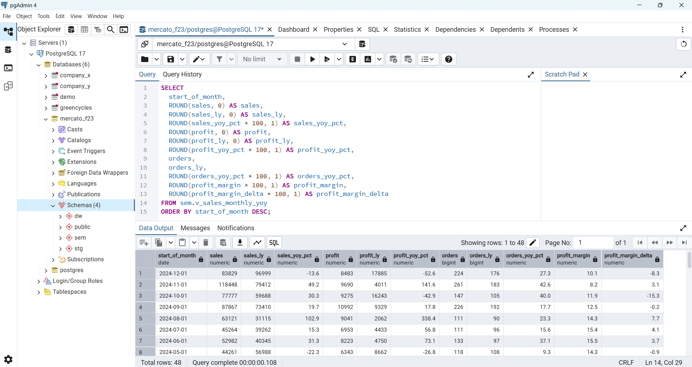
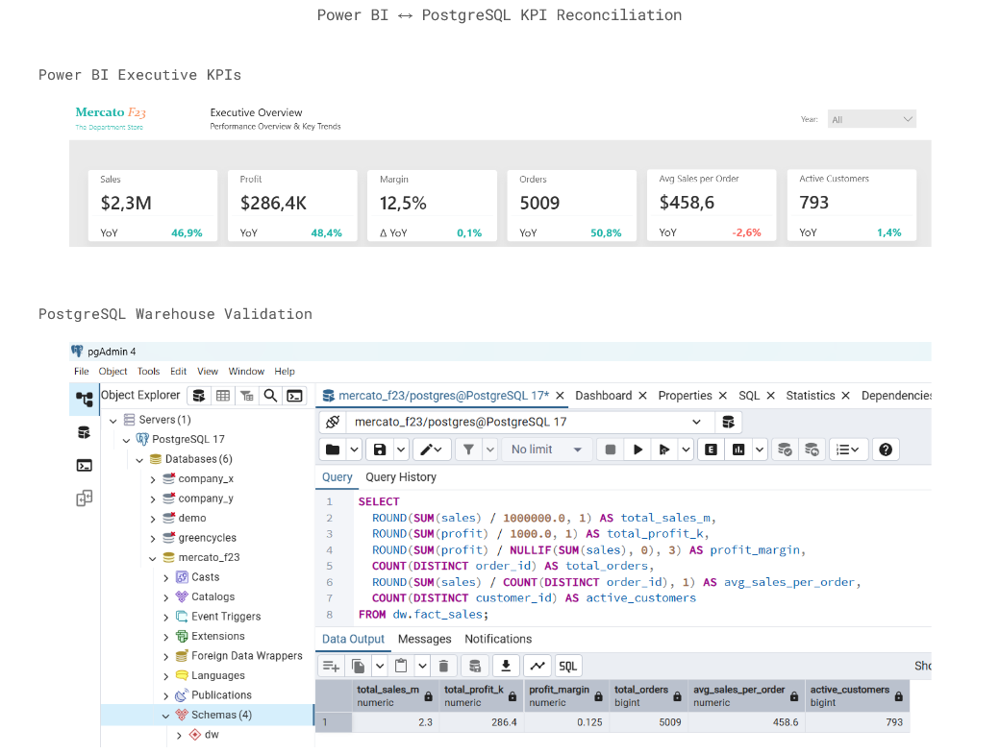

# MercatoF23-PostgreSQL-Warehouse
PostgreSQL warehouse, star schema, and SQL semantic layer built as an extension of the Mercato F23 retail analytics project.

## Objective

This project extends the Mercato F23 Power BI dashboard by rebuilding the analytical model in PostgreSQL. The objective was to demonstrate end-to-end BI modeling outside Power BI through star schema design, SQL-based semantic views, and KPI reconstruction directly in the warehouse layer.

The source dataset is the Tableau “Sample Superstore” dataset, with original years shifted from 2014–2017 to 2021–2024.

---

## Architecture

The database is organized into three schemas:

- `stg` → raw and typed staging layer
- `dw` → curated star schema
- `sem` → semantic layer exposing business-ready analytical views

### Data Flow

```text
CSV source
→ stg.fact_sales_raw
→ stg.v1_fact_sales_typed
→ dw star schema
→ sem analytical views
```

## Warehouse Schema



---

## Data Modeling Decisions

### Staging Layer

The raw CSV file is first loaded into `stg.fact_sales_raw` using text columns to avoid failures related to:

- encoding issues
- date parsing
- decimal formatting
- quoted text inconsistencies

A typed staging view (`stg.v1_fact_sales_typed`) then:

- converts dates using `to_date()`
- shifts years forward by +7 years
- casts numeric columns to analytical precision
- standardizes data types before warehouse loading

### Warehouse Layer (`dw`)

The warehouse uses a star schema.

#### Dimensions

- `dw.dim_customer`
- `dw.dim_product`
- `dw.dim_geography`
- `dw.dim_date`

#### Fact Table

- `dw.fact_sales`

The fact grain is:

```text
1 row = 1 sales line item
```

`row_id` is used as the fact table primary key because `order_id` may contain multiple products.

### Product Data Quality Handling

The source dataset contains multiple cases where the same `product_id` is associated with different product names.

A deterministic canonical product record was selected during dimension loading to preserve uniqueness of the product dimension key.

### Date Dimension Alignment

The SQL date dimension was aligned with the Power BI calendar (2021–2024) to ensure KPI reconciliation between PostgreSQL and Power BI outputs.

---

## Semantic Layer (`sem`)

The semantic layer exposes reusable analytical views by business grain.

### Monthly Analytics

- `sem.v_sales_monthly`
- `sem.v_sales_monthly_yoy`
- `sem.v_sales_monthly_ma`
- `sem.v_seasonality_avg_monthly_sales`

Includes:

- sales
- profit
- quantity
- orders
- customers
- products
- profit margin
- YoY metrics
- rolling averages
- seasonality metrics

### Customer Analytics

- `sem.v_customer_sales`
- `sem.v_customer_sales_ranked`
- `sem.v_kpi_top20pct_customers_sales_share`

Includes:

- customer-level sales and profitability
- customer ranking
- cumulative sales share
- Pareto concentration KPI

### Product Analytics

- `sem.v_product_sales`

Includes:

- product-level sales
- profitability
- quantity
- customer reach
- order metrics

### Geography Analytics

- `sem.v_geography_sales`

Includes:

- geography-level sales
- profitability
- customer and order metrics

## Semantic Layer Example



---

## Data Quality (DQ) Checks

Lightweight DQ views were added to validate warehouse integrity.

### Audit Views

- `sem.v_dq_duplicate_row_ids`
  - identifies duplicate `row_id` values in staging

- `sem.v_dq_new_rows_not_loaded`
  - identifies staging rows not yet loaded into the warehouse fact table

Additional validation queries were used to reconcile semantic-layer totals against `dw.fact_sales`.

## Power BI ↔ PostgreSQL KPI Reconciliation


---

## Refresh / Incremental Load Strategy

The current project implements a full initial warehouse load.

For recurring refresh scenarios, the intended process would be:

```text
New source snapshot
→ staging load
→ typed validation layer
→ dimension updates
→ insert new fact rows
→ semantic validation checks
```

New fact rows would be identified using `row_id` as the warehouse matching key.

Incremental loading would use `NOT EXISTS` logic to prevent duplicate fact inserts while preserving warehouse history and semantic consistency.

---

## Technical Scope

This project showcases:

- SQL-based BI modeling
- star schema design
- semantic layer architecture
- KPI reconstruction outside Power BI
- data quality validation
- warehouse reconciliation logic
- window functions and analytical SQL
- incremental load design concepts
